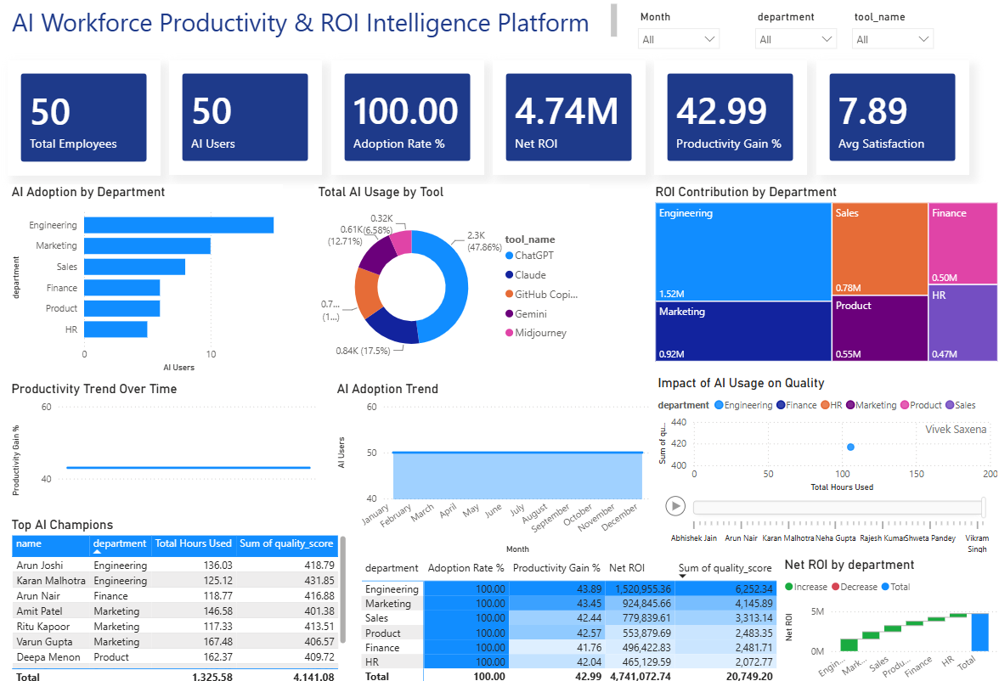

# AI Workforce Productivity & ROI Intelligence Dashboard

## Project Overview

An enterprise-grade Power BI dashboard designed to monitor AI adoption, workforce productivity, employee satisfaction, tool utilization, and ROI across departments.

### Key Business Objectives

- Measure AI adoption across departments
- Analyze productivity improvements from AI usage
- Track employee satisfaction scores
- Monitor AI tool utilization
- Quantify ROI generated through AI implementation

---

## Dashboard Preview

---

## Key Metrics

| KPI | Value |
|-------|---------|
| Total Employees | 50 |
| AI Users | 50 |
| Adoption Rate | 100% |
| Productivity Gain | 42.99% |
| Net ROI | ₹4.74M |
| Avg Satisfaction | 7.89 |

---

## Features

### AI Adoption Analytics
- Department-wise AI adoption
- Adoption trend monitoring
- User participation tracking

### Productivity Analysis
- Productivity gain measurement
- Employee performance monitoring
- AI champion identification

### ROI Intelligence
- Department-wise ROI contribution
- ROI waterfall analysis
- Financial impact tracking

### AI Tool Usage
- ChatGPT utilization
- Claude usage
---

## Tech Stack

- Power BI
- SQL
- DAX
- Power Query
- Data Modeling

---

## Dashboard Insights

### Top Performing Department
Engineering generated the highest ROI contribution of ₹1.52M.

### Productivity Impact
AI adoption resulted in a 42.99% increase in workforce productivity.

### Financial Outcome
The organization achieved a net ROI of ₹4.74M from AI implementation.

---

## Skills Demonstrated

- Business Intelligence
- Dashboard Design
- Data Modeling
- DAX Calculations
- KPI Development
- ROI Analytics
- Workforce Analytics
- Data Visualization

---

## Author

Madhur Attreya

LinkedIn: www.linkedin.com/in/madhurattreya
